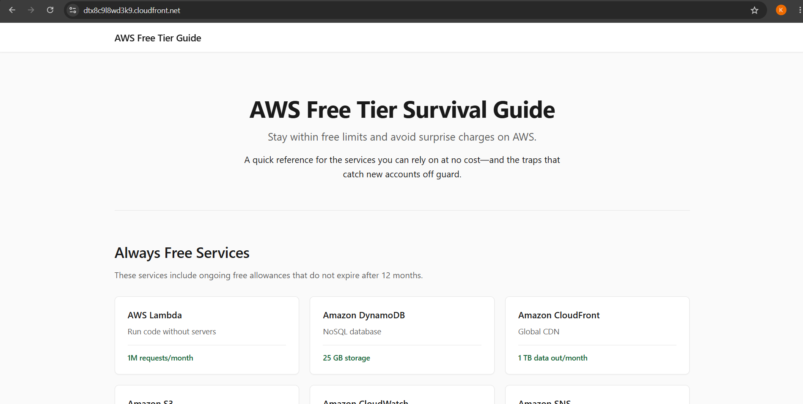
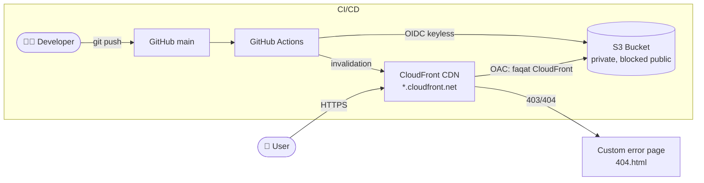

# AWS Static Site with CloudFront CDN & CI/CD

A production-style static website hosted on a **private S3 bucket**, served globally 
through **CloudFront with Origin Access Control (OAC)**, and deployed automatically 
via **GitHub Actions with OIDC** (no stored AWS keys).

**🔗 Live demo:** https://dtx8c9l8wd3k9.cloudfront.net



## Architecture



**Request flow:** User → CloudFront (HTTPS, edge caching) → private S3 origin via OAC.  
**Deploy flow:** push to `main` → GitHub Actions → build → `aws s3 sync` → CloudFront invalidation.

## Tech Stack

- **Astro** — static site generator
- **Amazon S3** — private origin storage (all public access blocked)
- **Amazon CloudFront** — global CDN, HTTPS, custom error pages
- **GitHub Actions** — CI/CD with OIDC keyless authentication
- **IAM** — least-privilege deploy role (scoped to one bucket + one distribution)

## Key Features

- 🔒 **Private S3 bucket** — content is only reachable through CloudFront (OAC pattern)
- 🚀 **Zero-touch deploys** — every push to `main` goes live automatically
- 🔑 **No stored credentials** — GitHub authenticates to AWS via OIDC
- 🧹 **Cache invalidation** — users always see the latest version
- 🧭 **Custom 403/404 pages** — no ugly XML errors
- ⚡ **Lighthouse 90+** on all categories

## CI/CD Pipeline

| Step | What it does |
|---|---|
| Checkout + Node setup | Prepares the build environment |
| `npm ci` + `npm run build` | Builds the site into `dist/` |
| Link check | Fails the build if internal links are broken |
| Configure AWS (OIDC) | Assumes an IAM role — no long-lived keys |
| `aws s3 sync --delete` | Uploads only changed files, removes stale ones |
| CloudFront invalidation | Clears the CDN cache |

## Security Notes

- S3 **Block Public Access: ON** — the bucket policy only allows this specific 
  CloudFront distribution (`AWS:SourceArn` condition).
- The deploy role's IAM policy is scoped to exactly one bucket and one distribution.
- HTTP requests are redirected to HTTPS at the edge.

## Cost / Free Tier

Runs at **$0**: CloudFront always-free tier (1 TB egress/month), a tiny S3 storage 
footprint, and free invalidations (first 1,000 paths/month). **No Route 53** — the 
free `*.cloudfront.net` domain provides HTTPS out of the box.

## Running Locally

```bash
npm install
npm run dev        # http://localhost:4321
npm run build      # outputs to dist/
```

## Project Structure

```text
├── .github/
│   └── workflows/
│       └── deploy.yml      # CI/CD pipeline configuration
├── docs/
│   └── architecture.md     # Architectural diagrams and notes
├── screenshots/            # Project evidence and Lighthouse scores
├── src/                    # Astro source code (pages, components)
├── public/                 # Static assets
├── astro.config.mjs        # Astro configuration
└── README.md               # Project documentation
```

## What I Learned

- **Security First (OAC vs Public Bucket):** Initially, I configured the S3 bucket for public access, which is a common anti-pattern. I quickly realized the security risks and refactored the architecture to use CloudFront Origin Access Control (OAC). Now, the S3 bucket is entirely private, and content is exclusively served securely through the CDN.
- **Keyless Authentication (OIDC):** Implementing OIDC for GitHub Actions was a major step forward. I learned how to securely establish a trust relationship between GitHub and AWS without hardcoding or rotating long-lived IAM user keys.
- **CDN Caching Strategies:** Understanding why automated deployments didn't instantly reflect on the live site taught me the necessity of CloudFront cache invalidations in the pipeline to ensure users always see the latest version.