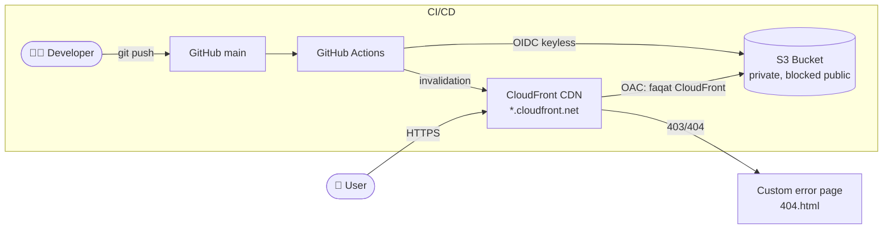

# AWS Static Site CI/CD Architecture

## Architecture Diagram

## Overview
This project is a fast, modern static website built with Astro and hosted securely on Amazon Web Services (AWS). 

## Day 1-3: Initial Setup & Storage
- **Framework:** Initialized the project using Astro for optimized static site generation.
- **Storage:** Provisioned an Amazon S3 bucket to store the compiled static assets (`./dist`).

## Day 4: Content Delivery Network (CDN) & Security
- **Amazon CloudFront:** Deployed a CloudFront distribution to serve the static website globally, ensuring low latency and high performance.
- **HTTPS & OAC:** Enforced `Redirect HTTP to HTTPS` for secure connections. The origin S3 bucket remains completely private and is accessed by CloudFront securely via **Origin Access Control (OAC)**.
- **Custom Error Handling:** Configured custom error responses in CloudFront to intercept S3 `403 Forbidden` and `404 Not Found` errors, gracefully redirecting users to a custom `/404.html` page.

## Day 5: CI/CD Pipeline (GitHub Actions & OIDC)
- **Automation:** Implemented a full CI/CD pipeline using GitHub Actions to automatically build and deploy the site to S3 on every push to the `main` branch.
- **Security (OIDC):** Configured OpenID Connect (OIDC) between AWS and GitHub. This allows GitHub Actions to securely assume an IAM role and get temporary credentials without storing any long-lived AWS access keys as secrets.
- **Deployment & Caching:** The workflow syncs the compiled `dist/` directory to S3 and automatically invalidates the CloudFront cache to serve the latest content immediately.
- **Testing:** Added a link-checker step to ensure no broken links are deployed.